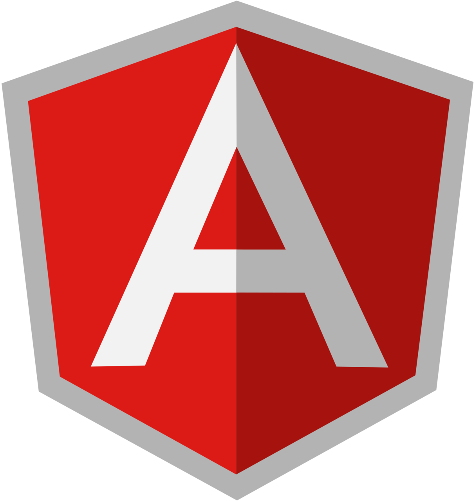
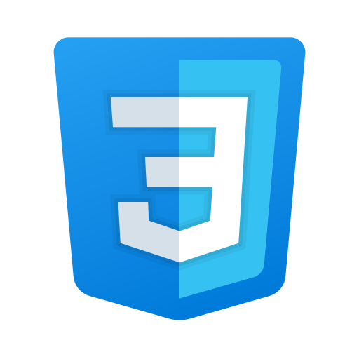

# 4EachGuy's

## 🔰 Equipo: 
* 👨 David Carreño (Líder)
* 👨 Daniel Navas
* 👧 Diana Diaz
* 👨 Sergio Garavito

## 🛠️ Tecnologías usadas:

    
    

---
## ✅ Estado:

|No.| 📦 Módulo | 🚩 Estado | 🚧 Pendiente |
|:-:|:---------:|:---------:|:--------------:|
|1  |Login      |En proceso |Estilos|

---

## 📑 Pasos:

1. **Descargue y descomprima el .zip o clone el proyecto**

1. **URL's navegador web:**
    * http://localhost:4200

---
# 🔐 Licencia